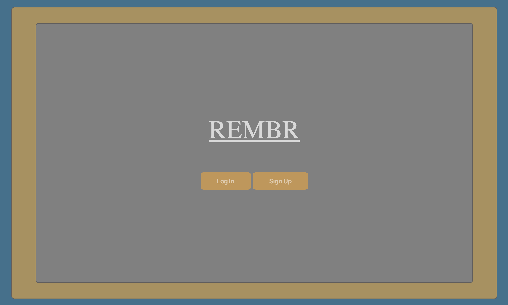
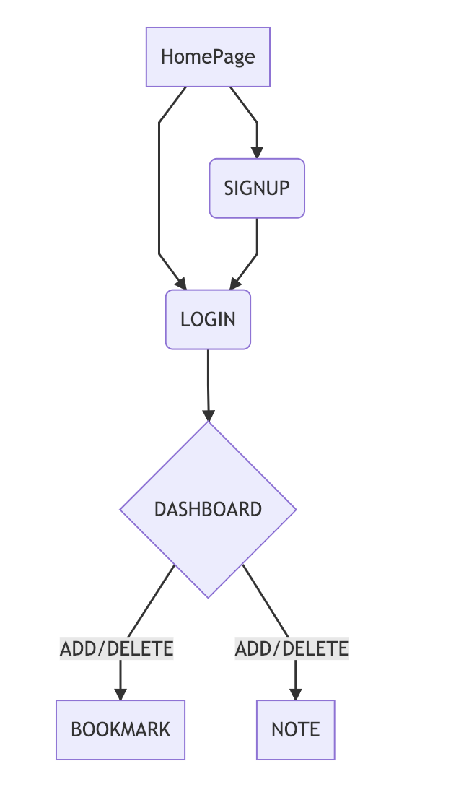

# REMBR

REMBR is a content manager that allows the user to save Links, their titles and comments, as well as peronal notes to an online database.  
User must login to save information, information is saved to the user model and accessed only by logging in.  Information is only viewable by logged in user.

It is a MEHN (MngoDB, Express, Handlebars, and Node.js) application. REMBR featuers full CRUD (create, read, update, destory).

This app has been deloyed to Heroku. Given how slow Heroku may be, you may find you need to refresh the page a few times to wake it up.

# Worksing in progress
As of Feb. 1, 2019:  
    1. Finish styling across all pages
    2. Refactor code to be dry
    3. Clean up CSS

# Future Adds:
1. Would like to add the ability to upload screenshots or show a small preview of the current site
2. Add a line that pulls random affirmations for each login at the top of dashboard page

# Plan for Creation:

#Planning

  Day 1: 
  
  1. User Story
  2. Wire Frame
  3. Create Repo
  4. Setup directory/file structure
  5. plan dependencies
  6. install dependencies
  7. build express server

  Day 2: 

  1. build models: User, Bookmark
  2. add User authentication with password hashing
  3. create view for login
  4. create view for sign up
  5. create view for login

  day 3:
  1. setup routes for show login
  2. setup controller for show login
  3. setup routes for signup
  4. setup controller for signup
  5. setup routes for new bookmark
  6. setup controller for newbookmark

  day 4:
  1. maintain sanity
  2. finish update/delete logic/routes/controller

  day 5:
  1. hold it together
  2. style
  3. user documentation
  4. deploy to Heroku
  5. screen cast
